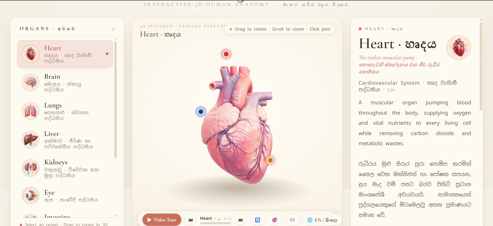
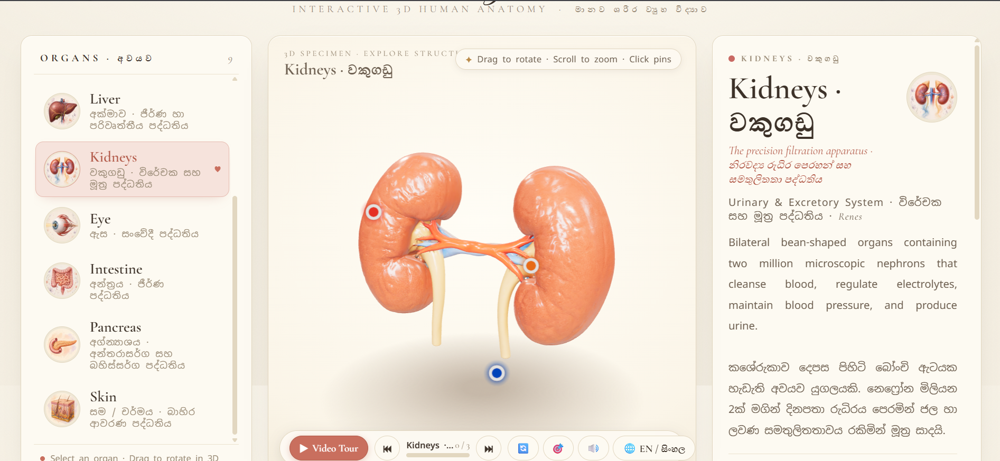
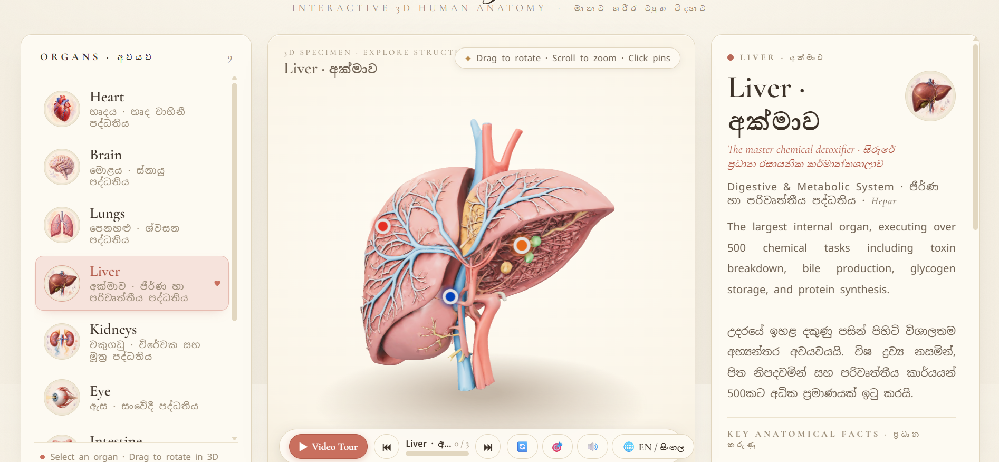

# 🫀 3D Human Anatomy Atelier
### මානව ශරීර ව්‍යුහ විද්‍යාව — අන්තර්ක්‍රියාකාරී ත්‍රිමාන අධ්‍යාපනික වේදිකාව

> **An immersive, WebGL-powered 3D human anatomy educational platform featuring interactive specimen exploration, cinematic guided video tours, Web Audio sound synthesis, and bilingual curriculum support (English & Sinhala / සිංහල).**

[](https://thilina-samarasinghe.github.io/3D-Anatomy-Atelier/)
[](https://threejs.org/)
[](#-bilingual-mastery-english--සිංහල)
[](#)

---

## 📸 Visual Showcase & Interface Gallery

<div align="center">
  
  <p><em>▲ Cardiovascular System: Interactive 3D Heart (හෘදය) with anatomical pinpoints and timeline video tour</em></p>
</div>

<br/>

<div align="center">
  
  
  <p><em>▲ Left: Excretory System — Kidneys (වකුගඩු) &nbsp;|&nbsp; Right: Digestive & Metabolic Core — Liver (අක්මාව)</em></p>
</div>

---

## 🎓 Why 3D Anatomy Atelier? Advantages for Students & Educators

Traditional biology education often relies on flat 2D textbook diagrams and dense blocks of text. However, real biological systems are complex, dynamic three-dimensional structures. **3D Anatomy Atelier** bridges this gap by transforming passive memorization into active, multi-sensory discovery.

### 🧠 1. Spatial Learning & True 3D Depth Perception
- **True Spatial Relationships**: Textbooks flatten organs, making it difficult for students to understand anterior, posterior, dorsal, and ventral orientations. In this atelier, students can freely orbit 360°, pitch, and zoom into real anatomical contours.
- **Relational Understanding**: Students can see exactly where the renal pelvis connects to the ureter, how the aorta arches over pulmonary arteries, or how hepatic lobes align.

### 🔁 2. Superior Memory Retention Through Active Exploration
- **Active Recall vs. Passive Reading**: Research in cognitive science demonstrates that interactive, self-directed exploration yields **up to 75% higher knowledge retention** compared to reading static pages.
- **Interactive Hotspot Pins**: Instead of looking at confusing numbered lists in textbook keys, learners click directly on glowing anatomical hotspots to instantly reveal targeted physiological details, Latin terminology, and key biological functions.
- **Micro-Learning & Cognitive Load Reduction**: Information is organized into digestible chunks—fast facts, physiological summaries, and structural highlights—preventing cognitive overload.

### 🎥 3. Cinematic Guided Video Tours
- **Automated Guided Learning**: Students who don't know where to begin can press **Play (▶ Video Tour)**.
- **Smooth Trajectory Cinematography**: The camera autonomously glides between critical anatomical landmarks, framing each structure perfectly while updating educational cards in real time.
- **Self-Paced Scrubbing**: Students can pause, jump forward, or scrub backwards using the interactive timeline to revisit challenging exam topics at their own pace.

### 🔊 4. Auditory Dual-Coding (Sound Synthesis)
- **Multi-Sensory Engagement**: Utilizes the browser's built-in **Web Audio API** to synthesize rhythmic cardiac *Lub-Dub* beats and harmonic crystal cues when interacting with hotspots.
- **Dual-Coding Theory**: Pairing auditory rhythm with visual motion creates dual cognitive neural pathways, significantly strengthening long-term recall during exams and practical tests.

### 🇱🇰 5. Bilingual Sri Lankan Curriculum Mastery (English & සිංහල)
- **100% Curriculum Standard**: Features exact Sri Lankan G.C.E. Ordinary Level (O/L), Advanced Level (A/L) Biology, and university medical terminology.
- **Instant Language Toggling**: Students can toggle between **English** and **සිංහල** with a single click (`🌐 EN / සිංහල`), helping bilingual students master international medical English alongside their native mother tongue.
- **Zero Foreign Mistranslations**: All Chinese/foreign placeholders have been fully replaced with authentic Sri Lankan biological terminology (e.g., *හෘදය, මහා ධමනිය, වම් කෝෂිකාව, වකුගඩු බාහිකය, වකුගඩු මජ්ජාව, අක්මාව, පිත්තාශය*).

---

## 🫁 Comprehensive Anatomical Catalog

| Organ / අවයවය | Biological System | Key Hotspots Visualized |
| :--- | :--- | :--- |
| **Heart · හෘදය** | Cardiovascular (හෘද වාහිනී) | Aorta (මහා ධමනිය), Left Ventricle (වම් කෝෂිකාව), Right Atrium (දකුණු කර්ණිකාව) |
| **Brain · මොළය** | Central Nervous (ස්නායු) | Frontal Lobe (ප්‍රලලාට ඛණ්ඩිකාව), Cerebellum (අනුමොළය), Brainstem (මොළයේ කඳ) |
| **Lungs · පෙනහැල්ල** | Respiratory (ශ්වසන) | Trachea (ශ්වාසනාලය), Bronchi (ශ්වාසනාලිකා), Alveoli (වායු කෝෂ) |
| **Liver · අක්මාව** | Digestive & Metabolic (ජීර්ණ) | Right Lobe (දකුණු ඛණ්ඩිකාව), Gallbladder (පිත්තාශය), Portal Vein (නිවේශිකා ශිරාව) |
| **Kidneys · වකුගඩු** | Urinary & Excretory (ව්‍යුහ විද්‍යාත්මක) | Renal Cortex (බාහිකය), Renal Medulla (මජ්ජාව), Ureter (මුත්‍ර වාහිනිය) |
| **Eyeball · ඇස** | Sensory (සංවේදී) | Cornea (ස්වච්ඡය), Iris (තාරා මණ්ඩලය), Optic Nerve (දෘෂ්ටි ස්නායුව) |
| **Intestine · අන්ත්‍රය** | Digestive (ජීර්ණ) | Duodenum (ග්‍රහණිය), Small Intestine (ක්ෂුද්‍රාන්තය), Colon (මහාන්තය) |
| **Pancreas · අග්න්‍යාශය** | Endocrine & Exocrine (අන්තරාසර්ග) | Head of Pancreas (අග්න්‍යාශ ශීර්ෂය), Pancreatic Duct (ප්‍රධාන නාලය), Tail (වලිගය) |
| **Skin · සම** | Integumentary (ආවරණ) | Epidermis (උපචර්මය), Dermis (චර්මය), Hair Follicle (රෝම කූපය) |

---

## 🌐 Live Web Deployment (GitHub Pages)

This project runs 100% client-side without any backend requirements:
👉 **[Launch 3D Anatomy Atelier Live](https://thilina-samarasinghe.github.io/3D-Anatomy-Atelier/)**

---

## 💻 Running Locally

To run the application locally on your computer:

1. Clone or download this repository:
   ```bash
   git clone https://github.com/Thilina-Samarasinghe/3D-Anatomy-Atelier.git
   cd 3D-Anatomy-Atelier
   ```
2. Double-click **`start_server.bat`** (or execute Python's built-in server):
   ```bash
   python -m http.server 8080
   ```
3. Open your browser and navigate to:
   ```text
   http://localhost:8080
   ```

---

## 🛠️ Technology Stack
- **Rendering & 3D Core**: [Three.js](https://threejs.org/) (r160) with WebGL, ACES Filmic Tone Mapping, PBR materials, and Meshopt compression.
- **Audio Engine**: Native HTML5 Web Audio API (real-time harmonic oscillator synthesis).
- **Interface & Typography**: Custom Vanilla CSS with responsive CSS Grid/Flexbox, Cormorant Garamond, and Noto Sans Sinhala.
- **Asset Pipeline**: Compact GLTF/GLB binary meshes (~1 MB per organ) optimized for rapid mobile & web loading.
